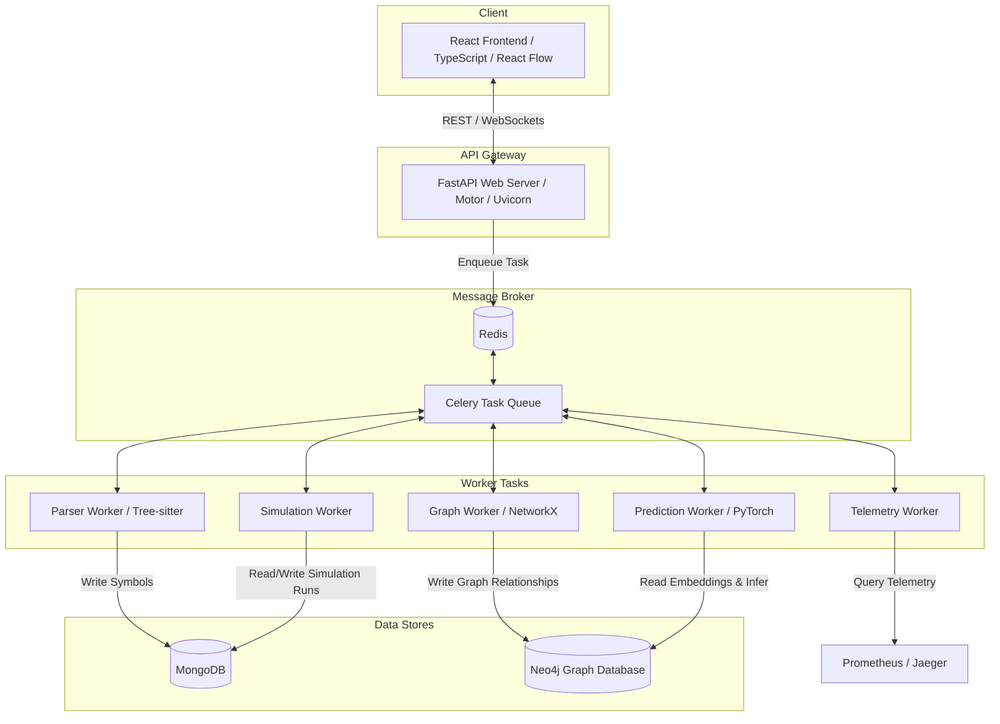

# System Overview — Catalyst Architecture

This document describes the high-level system architecture of the Catalyst Software Digital Twin platform.

---

## 🏗️ High-Level Component Topology

---

## 🏛️ Layered Design

Catalyst organizes its capabilities into a clean, unidirectional stack:

1. **Repository Layer** (`parser`): Ingests raw repository source code, parses files using Tree-sitter, and extracts structural symbols.
2. **Knowledge Layer** (`graph`): Constructs the Software Genome (dependency graphs, call graphs) and saves node relationships to Neo4j.
3. **Runtime Layer** (`telemetry`): Queries dynamic performance data (Prometheus / Jaeger metrics) and links them to graph nodes.
4. **Intelligence Layer** (`simulation`, `prediction`, `optimization`): Executes rule-based simulations and runs GNN predictions to score future changes.
5. **Presentation Layer** (`api`, `frontend`): Provides standard REST endpoints, WebSockets updates, and interactive visualizations.
